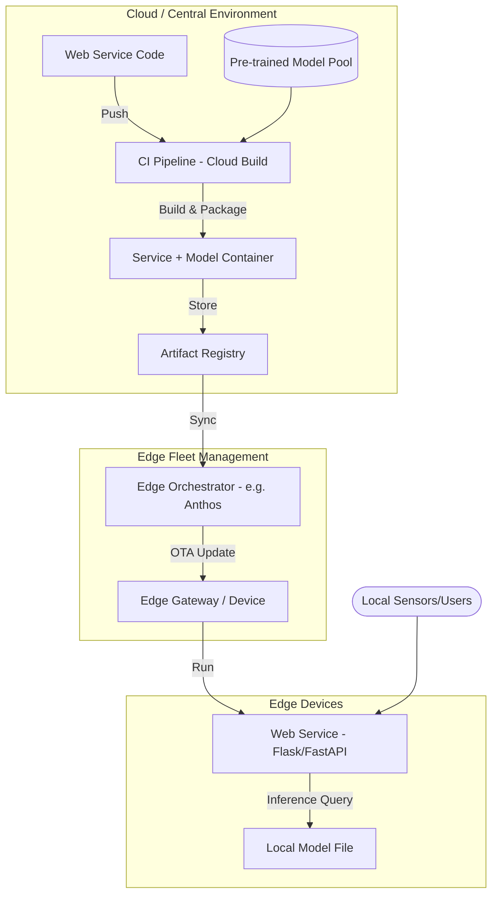
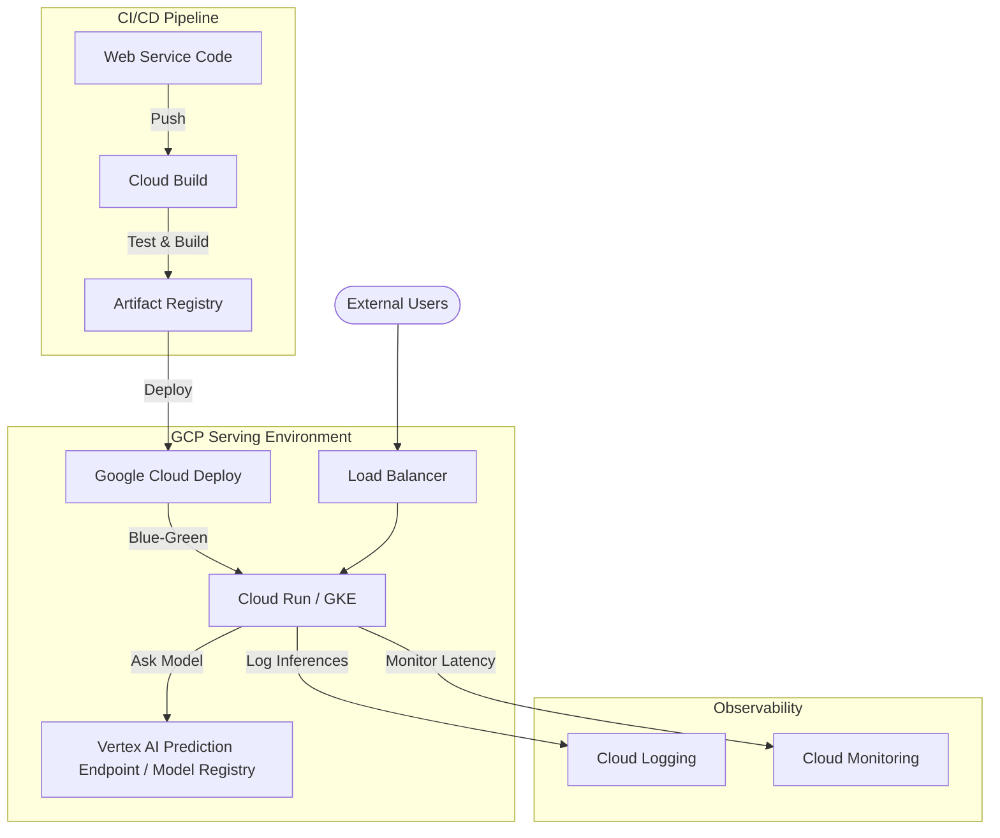

# ML Inference CI/CD Architecture: Cloud vs. Edge

This document outlines the CI/CD processes for web services that perform ML inference. This design assumes the model is already trained and focuses solely on the delivery and orchestration of the inference service.

---

## 1. Case 1: Inference at the Edge
In this scenario, a pre-trained model is bundled or deployed alongside a web service to edge devices for local, low-latency execution.

### Architecture Diagram (Edge Inference)

---

## 2. Case 2: Inference in the Cloud (GCP)
A centralized cloud environment where the web service runs in a managed environment and queries a model stored in a registry or hosted on a managed endpoint.

### Architecture Diagram (Cloud Inference)

---

## 3. Key Design Choices for Inference-Only

| Feature | Edge Inference | Cloud Inference (GCP) |
| :--- | :--- | :--- |
| **Model Delivery** | Pre-packaged in container or side-loaded. | Fetched at runtime or via managed endpoint. |
| **Network Dependency** | Zero requirement for inference. | Required for API calls/Model fetch. |
| **Updates** | Batch / Periodic sync. | Instant (Canary/Blue-Green). |
| **Scaling** | Limited by device hardware. | Highly elastic (Autoscaling). |

## 4. Operational Best Practices
1.  **Model Versioning**: Ensure the web service code is explicitly tied to a specific model version in the `config` or `environment variables`.
2.  **Health Checks**: Implement custom logic to ensure the model is loaded and "warm" before the service reports healthy.
3.  **Inference Logging**: Even without training, log the inputs/outputs to detect when the model might need a manual trigger for re-evaluation.
